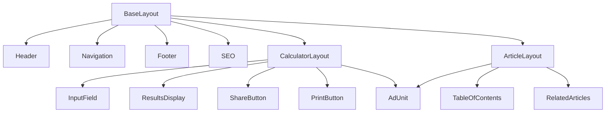
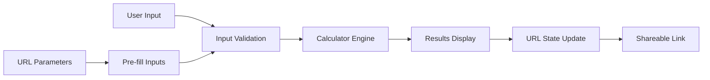
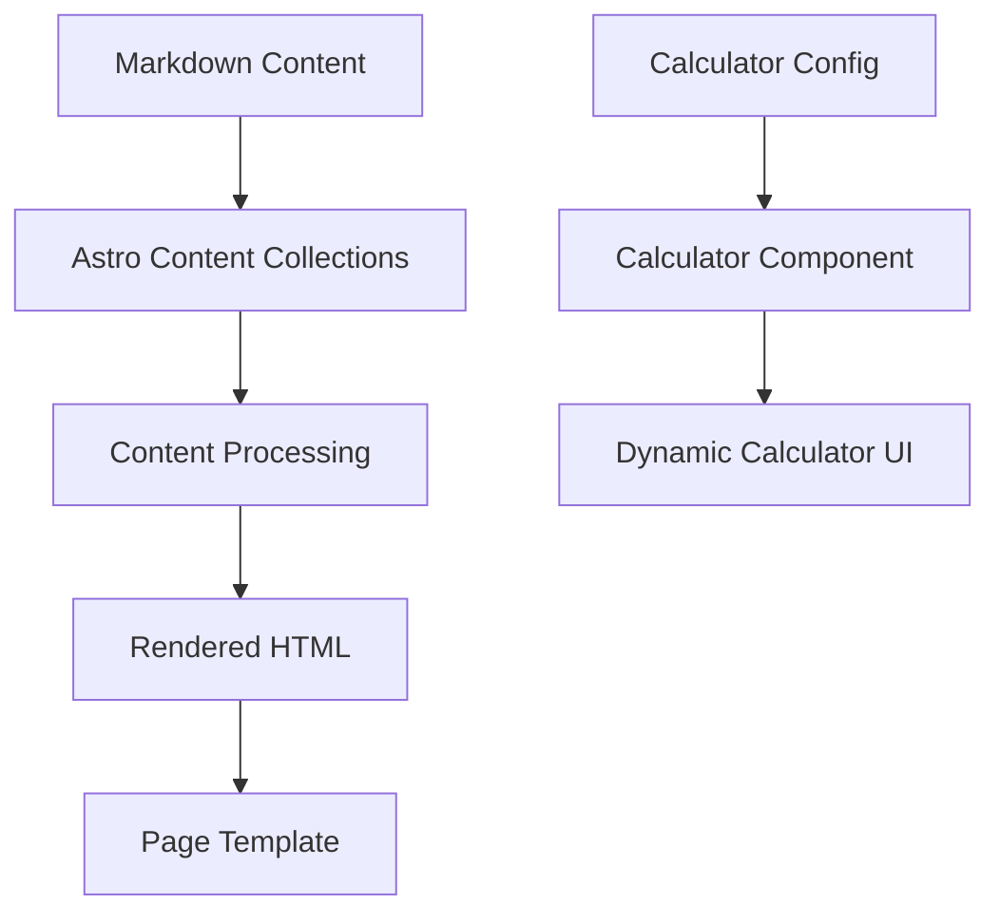

# GetLifeSorted.com - Architectural Plan

## Overview

This document outlines the architectural plan for GetLifeSorted.com, a static, extensible, low-maintenance website providing financial tools, calculators, and informative articles. The site will be built using Astro as the static site generator, hosted on Cloudflare Pages, and styled with Tailwind CSS.

## Core Requirements

- Static site generation with Astro
- Hosting on Cloudflare Pages with custom domain (getlifesorted.com)
- Templating for articles and calculators
- Google AdSense integration
- Plausible Analytics integration
- Tailwind CSS for styling
- No WordPress or heavy CMS, no backend required
- Mobile-friendly and responsive design
- Fast load times
- SEO optimization
- Easy integration of tracking and advertisements

## 1. Folder Structure

```
get-life-sorted-git/
├── .github/                      # GitHub Actions workflows for CI/CD
│   └── workflows/
│       └── deploy.yml            # Deployment workflow to Cloudflare Pages
├── public/                       # Static assets that don't need processing
│   ├── favicon.ico
│   ├── robots.txt
│   ├── site.webmanifest
│   └── images/                   # Static images
├── src/
│   ├── components/               # Reusable UI components
│   │   ├── global/               # Site-wide components
│   │   │   ├── Header.astro
│   │   │   ├── Footer.astro
│   │   │   ├── Navigation.astro
│   │   │   ├── SEO.astro         # SEO component for meta tags
│   │   │   └── AdUnit.astro      # Reusable AdSense component
│   │   ├── calculators/          # Calculator-specific components
│   │   │   ├── CalculatorLayout.astro  # Base layout for calculators
│   │   │   ├── InputField.astro  # Reusable input component
│   │   │   ├── ResultsDisplay.astro    # Results visualization
│   │   │   ├── ShareButton.astro # URL parameter sharing
│   │   │   └── PrintButton.astro # Print-friendly results
│   │   └── articles/             # Article-specific components
│   │       ├── ArticleLayout.astro
│   │       ├── TableOfContents.astro
│   │       └── RelatedArticles.astro
│   ├── layouts/                  # Page layouts
│   │   ├── BaseLayout.astro      # Base layout with common elements
│   │   ├── CalculatorLayout.astro # Layout for calculator pages
│   │   └── ArticleLayout.astro   # Layout for article pages
│   ├── pages/                    # Astro pages (routes)
│   │   ├── index.astro           # Homepage
│   │   ├── about.astro           # About page
│   │   ├── contact.astro         # Contact page
│   │   ├── calculators/          # Calculator pages
│   │   │   ├── index.astro       # Calculator directory
│   │   │   ├── rental-insurance.astro
│   │   │   ├── home-insurance.astro
│   │   │   ├── life-insurance.astro
│   │   │   ├── retirement-savings.astro
│   │   │   ├── college-savings.astro
│   │   │   └── [slug].astro      # Dynamic route for future calculators
│   │   └── articles/             # Article pages
│   │       ├── index.astro       # Article directory
│   │       └── [slug].astro      # Dynamic route for articles
│   ├── content/                  # Content collections (Astro's content system)
│   │   ├── articles/             # Markdown files for articles
│   │   │   ├── first-bank-account.md
│   │   │   ├── credit-card-application.md
│   │   │   └── insurance-guides/
│   │   │       ├── rental-insurance.md
│   │   │       ├── home-insurance.md
│   │   │       └── ...
│   │   └── calculators/          # JSON/YAML files for calculator configurations
│   │       ├── rental-insurance.json
│   │       ├── home-insurance.json
│   │       └── ...
│   ├── scripts/                  # Client-side JavaScript
│   │   ├── calculator-engine.js  # Core calculation logic
│   │   ├── url-state.js          # URL parameter handling
│   │   └── analytics.js          # Analytics integration
│   ├── styles/                   # Global styles and Tailwind config
│   │   └── global.css
│   └── utils/                    # Utility functions
│       ├── seo.js                # SEO helpers
│       ├── calculator-utils.js   # Shared calculator functions
│       └── format-currency.js    # Number formatting
├── astro.config.mjs              # Astro configuration
├── tailwind.config.cjs           # Tailwind CSS configuration
├── tsconfig.json                 # TypeScript configuration
├── package.json                  # Dependencies and scripts
└── README.md                     # Project documentation
```

## 2. Component Architecture and Relationships

### Core Components Hierarchy



### Component Responsibilities

1. **Global Components**
   - `Header.astro`: Site branding, top navigation
   - `Footer.astro`: Copyright, links, secondary navigation
   - `Navigation.astro`: Primary site navigation
   - `SEO.astro`: Meta tags, Open Graph, structured data
   - `AdUnit.astro`: Configurable AdSense integration

2. **Calculator Components**
   - `CalculatorLayout.astro`: Wrapper for calculator pages
   - `InputField.astro`: Standardized form inputs with validation
   - `ResultsDisplay.astro`: Visualization of calculator results
   - `ShareButton.astro`: Generate shareable URLs with parameters
   - `PrintButton.astro`: Format results for printing

3. **Article Components**
   - `ArticleLayout.astro`: Wrapper for article pages
   - `TableOfContents.astro`: Auto-generated article navigation
   - `RelatedArticles.astro`: Suggests related content

## 3. Data Flow for Calculators and Content

### Calculator Data Flow



1. **Input Handling**:
   - User inputs are collected via form fields
   - Client-side validation ensures data integrity
   - Input changes trigger recalculation

2. **Calculation Process**:
   - Core calculator logic in `calculator-engine.js`
   - Calculator-specific formulas in individual calculator files
   - Results update reactively when inputs change

3. **State Management**:
   - Calculator state stored in URL parameters
   - Enables sharing of specific calculator results
   - Bookmarkable calculator states

### Content Data Flow



1. **Article Content**:
   - Stored as Markdown files in `content/articles/`
   - Processed by Astro's content collections
   - Frontmatter for metadata (title, description, categories)
   - Rendered into HTML at build time

2. **Calculator Configuration**:
   - Stored as JSON/YAML in `content/calculators/`
   - Defines inputs, formulas, and display options
   - Processed at build time to generate calculator pages

## 4. Deployment Strategy


1. **Build Process**:
   - Triggered by pushes to main branch
   - GitHub Actions workflow runs Astro build
   - Generates optimized static assets

2. **Deployment Pipeline**:
   - Static assets deployed to Cloudflare Pages
   - Custom domain configuration for getlifesorted.com
   - SSL/TLS handled automatically by Cloudflare

3. **Performance Optimization**:
   - Assets served from Cloudflare's global CDN
   - Automatic image optimization
   - Minification and compression of assets

4. **Monitoring and Analytics**:
   - Plausible Analytics for privacy-friendly tracking
   - Cloudflare analytics for performance monitoring
   - Regular performance audits via Lighthouse

## 5. Extensibility Considerations

### Adding New Calculators

1. **Template-Based Approach**:
   - Create new calculator configuration in `content/calculators/`
   - Define inputs, formulas, and display options
   - Reuse existing calculator components

2. **Dynamic Routes**:
   - `[slug].astro` handles dynamic calculator routes
   - New calculators automatically added to sitemap
   - Shared calculator engine handles common functionality

### Adding New Articles

1. **Content-Driven**:
   - Add new Markdown files to `content/articles/`
   - Include frontmatter for metadata
   - Articles automatically appear in listings and sitemaps

2. **Categorization System**:
   - Tag-based categorization for related content
   - Automatic generation of category pages
   - Cross-linking between related articles and calculators

### Future Expansion

1. **API Integration**:
   - Structure allows for future integration with external APIs
   - Could add market data or financial information sources
   - Maintain static generation with incremental builds

2. **User Accounts (if needed later)**:
   - Architecture supports adding authentication via Auth.js
   - Could store user preferences in localStorage initially
   - Path to adding serverless functions if needed

## 6. Technical Decisions and Tradeoffs

### Static Site Generation (SSG) vs. Server-Side Rendering (SSR)

**Decision**: Use Astro's static site generation for all pages.

**Rationale**:
- Maximizes performance with pre-rendered HTML
- Reduces hosting costs with static files
- Improves SEO with fast load times
- Calculators use client-side JavaScript only when needed

**Tradeoff**: Limited dynamic functionality without server components.

### Content Management

**Decision**: Use Astro's content collections with Markdown files instead of a CMS.

**Rationale**:
- No database dependency reduces maintenance
- Git-based workflow for content updates
- Markdown is easy to write and maintain
- Structured frontmatter for metadata

**Tradeoff**: Less user-friendly for non-technical content editors.

### JavaScript Strategy

**Decision**: Minimal JavaScript with progressive enhancement.

**Rationale**:
- Core content accessible without JavaScript
- Calculator functionality enhanced with JavaScript
- Improves performance and accessibility
- Reduces maintenance burden

**Tradeoff**: Some advanced calculator features may require JavaScript.

### CSS Framework

**Decision**: Tailwind CSS with custom design system.

**Rationale**:
- Utility-first approach speeds development
- Small bundle size with PurgeCSS
- Consistent design language across components
- Easy to customize and extend

**Tradeoff**: Steeper learning curve than traditional CSS frameworks.

### Analytics and Ads

**Decision**: Plausible Analytics and strategic AdSense placement.

**Rationale**:
- Privacy-friendly analytics with Plausible
- Non-intrusive ad placement for better user experience
- Dedicated AdUnit component for consistent implementation
- Strategic ad placement for better revenue

**Tradeoff**: Balance between ad revenue and user experience.

## 7. Implementation Recommendations

### Phase 1: Core Infrastructure

1. Set up Astro project with Tailwind CSS
2. Create base layouts and global components
3. Implement folder structure and basic routing
4. Configure GitHub Actions for CI/CD
5. Set up Cloudflare Pages deployment

### Phase 2: Calculator Framework

1. Develop calculator engine and core components
2. Implement URL parameter state management
3. Create first calculator (e.g., rental insurance)
4. Test and optimize calculator performance
5. Implement sharing and printing functionality

### Phase 3: Content Framework

1. Set up content collections for articles
2. Create article layout and components
3. Write initial articles
4. Implement SEO optimization
5. Add related content functionality

### Phase 4: Monetization and Analytics

1. Integrate Google AdSense
2. Set up Plausible Analytics
3. Optimize ad placement
4. Implement structured data for SEO
5. Configure performance monitoring

### Phase 5: Expansion and Refinement

1. Add remaining calculators
2. Expand article content
3. Optimize for mobile devices
4. Conduct performance audits
5. Refine user experience based on analytics