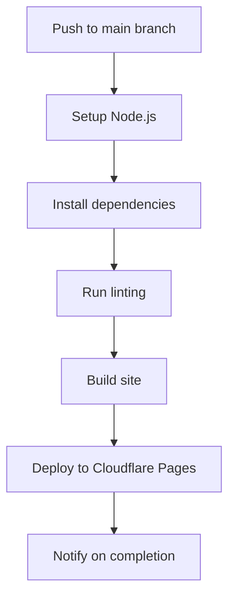

# Deployment and CI/CD Strategy for Get Life Sorted

## Current Project Analysis

### Project Structure
- **Framework**: Astro v5.8.0
- **CSS Framework**: Tailwind CSS v3.4.17
- **Build Command**: `npm run build`
- **Output Directory**: `dist`
- **Node Version**: 18 (specified in wrangler.toml)

### Current Deployment Configuration
- **Platform**: Cloudflare Pages (configured in wrangler.toml)
- **Domain**: getlifesorted.com
- **Environment Variables**:
  - PLAUSIBLE_DOMAIN
  - GOOGLE_ANALYTICS_ID
  - SITE_URL
  - ENABLE_ADS
  - ENABLE_NEWSLETTER

### Current Configuration Files
- **wrangler.toml**: Contains Cloudflare Pages configuration
- **public/_headers**: Security and caching headers
- **public/_redirects**: URL redirection rules

## Recommended CI/CD Strategy

### GitHub Actions Workflow

I recommend implementing a GitHub Actions workflow that will:
1. Build and test the Astro site
2. Deploy to Cloudflare Pages on successful build
3. Include basic linting for code quality

Here's the proposed GitHub Actions workflow:



### Deployment Platform

Based on the existing configuration and your preference, **Cloudflare Pages** is the recommended deployment platform:

**Advantages of Cloudflare Pages for this project**:
- Already configured in wrangler.toml
- Excellent global CDN performance
- Built-in security features
- Free tier is generous for most sites
- Seamless integration with other Cloudflare services
- Supports Astro builds natively

### Environment Variables and Secrets

The following environment variables and secrets should be configured:

**GitHub Secrets**:
- `CLOUDFLARE_API_TOKEN`: For deployment to Cloudflare Pages
- `CLOUDFLARE_ACCOUNT_ID`: Your Cloudflare account identifier

**Environment Variables in Cloudflare Pages**:
- `PLAUSIBLE_DOMAIN`: For analytics
- `GOOGLE_ANALYTICS_ID`: For Google Analytics
- `SITE_URL`: Site URL (https://getlifesorted.com)
- `ENABLE_ADS`: Feature flag for ads
- `ENABLE_NEWSLETTER`: Feature flag for newsletter

## Implementation Plan

### 1. GitHub Actions Workflow File

Create a `.github/workflows/deploy.yml` file with the following configuration:

```yaml
name: Deploy to Cloudflare Pages

on:
  push:
    branches: [main]

jobs:
  deploy:
    runs-on: ubuntu-latest
    name: Build and Deploy
    steps:
      - uses: actions/checkout@v3
        with:
          fetch-depth: 0

      - name: Setup Node.js
        uses: actions/setup-node@v3
        with:
          node-version: 18
          cache: 'npm'
          cache-dependency-path: 'gls/package-lock.json'

      - name: Install dependencies
        run: cd gls && npm ci

      - name: Install ESLint
        run: cd gls && npm install eslint --save-dev

      - name: Run ESLint
        run: cd gls && npx eslint src --ext .js,.ts,.astro || true

      - name: Build site
        run: cd gls && npm run build
        env:
          SITE_URL: https://getlifesorted.com

      - name: Publish to Cloudflare Pages
        uses: cloudflare/pages-action@v1
        with:
          apiToken: ${{ secrets.CLOUDFLARE_API_TOKEN }}
          accountId: ${{ secrets.CLOUDFLARE_ACCOUNT_ID }}
          projectName: getlifesorted
          directory: gls/dist
          gitHubToken: ${{ secrets.GITHUB_TOKEN }}
```

### 2. ESLint Configuration

Add a basic ESLint configuration file (`.eslintrc.js`) to the project:

```javascript
module.exports = {
  extends: [
    'eslint:recommended',
    'plugin:astro/recommended',
  ],
  overrides: [
    {
      files: ['*.astro'],
      parser: 'astro-eslint-parser',
      parserOptions: {
        parser: '@typescript-eslint/parser',
        extraFileExtensions: ['.astro'],
      },
      rules: {
        // Astro-specific rules
      },
    },
    {
      files: ['*.ts'],
      parser: '@typescript-eslint/parser',
      extends: [
        'plugin:@typescript-eslint/recommended',
      ],
      rules: {
        // TypeScript-specific rules
      },
    },
    {
      files: ['*.js'],
      parserOptions: {
        ecmaVersion: 'latest',
        sourceType: 'module',
      },
      rules: {
        // JavaScript-specific rules
      },
    },
  ],
};
```

### 3. Update package.json

Update the `package.json` file to include linting scripts:

```json
{
  "scripts": {
    "dev": "astro dev",
    "build": "astro build",
    "preview": "astro preview",
    "astro": "astro",
    "lint": "eslint src --ext .js,.ts,.astro",
    "lint:fix": "eslint src --ext .js,.ts,.astro --fix"
  },
  "devDependencies": {
    "eslint": "^8.38.0",
    "eslint-plugin-astro": "^0.26.1",
    "@typescript-eslint/eslint-plugin": "^5.59.0",
    "@typescript-eslint/parser": "^5.59.0"
  }
}
```

### 4. GitHub Repository Setup

1. Create the GitHub repository if not already done
2. Configure the required secrets in GitHub:
   - `CLOUDFLARE_API_TOKEN`
   - `CLOUDFLARE_ACCOUNT_ID`

### 5. Cloudflare Pages Configuration

Ensure the following settings in Cloudflare Pages:

1. Connect to your GitHub repository
2. Set build settings:
   - Build command: `npm run build`
   - Build output directory: `dist`
   - Root directory: `/gls` (since your project is in a subdirectory)
3. Configure environment variables:
   - `PLAUSIBLE_DOMAIN`
   - `GOOGLE_ANALYTICS_ID`
   - `SITE_URL`
   - `ENABLE_ADS`
   - `ENABLE_NEWSLETTER`

## Recommendations for Future Enhancements

Once the basic CI/CD workflow is established, consider these future enhancements:

1. **Automated Testing**: Add Jest for unit tests and Playwright for E2E tests
2. **Preview Deployments**: Enable preview deployments for pull requests
3. **Branch Protection Rules**: Implement branch protection for the main branch
4. **Performance Monitoring**: Add Lighthouse CI to monitor performance metrics
5. **Dependency Updates**: Add Dependabot for automated dependency updates

## Deployment Troubleshooting

This section documents common deployment issues encountered and their solutions to serve as a reference for the team.

### 1. Duplicate Key Error in wrangler.toml

**Issue**:
The deployment failed due to a duplicate key error in the wrangler.toml file. Specifically, the `pattern = "/images/*"` key was duplicated in the `[cache]` section.

**Solution**:
Restructured the cache configuration to use the `[[cache_rules]]` array of tables syntax instead of a single `[cache]` section with multiple entries. This approach allows for multiple cache rules with the same key names without causing conflicts.

### 2. Package.json and package-lock.json Synchronization Issues

**Issue**:
The deployment process encountered errors due to missing dependencies. The package-lock.json file was out of sync with package.json, particularly with devDependencies not properly included in the lock file.

**Solution**:
Regenerated the package-lock.json file using `npm install --package-lock-only` to properly include all dependencies and devDependencies. This ensured that all required packages were correctly listed in the lock file with their exact versions, resolving the synchronization issues.

### Recommended Preventive Measures

To prevent these issues in the future:

1. Always validate wrangler.toml configuration before deployment
2. Ensure package.json and package-lock.json are in sync after adding new dependencies
3. Consider adding a pre-deployment check in the CI/CD pipeline to verify configuration files